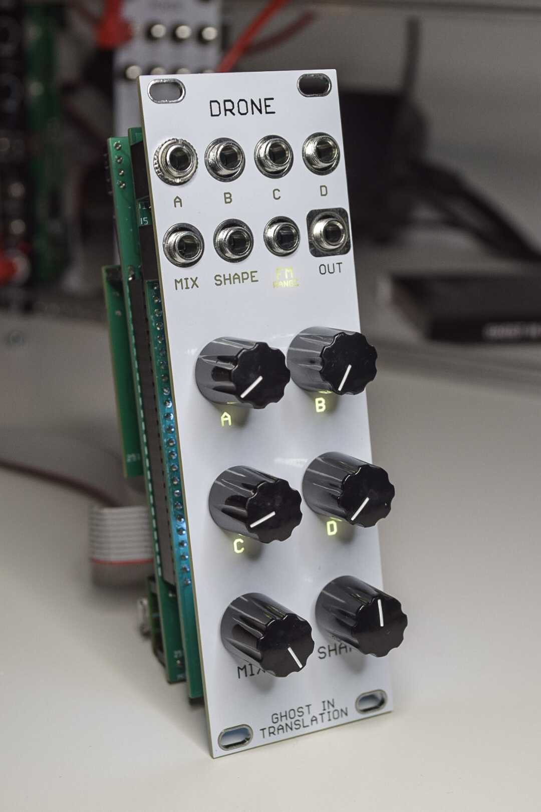
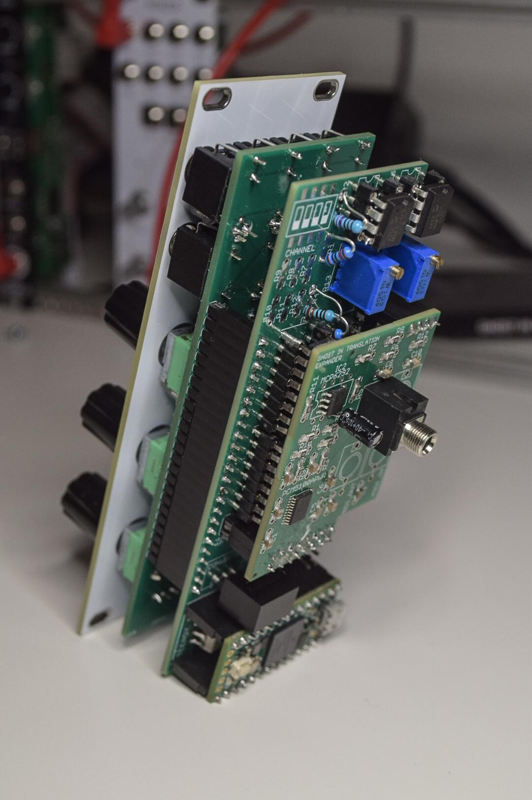

# DRONE 

Drone is a modular drone synthesizer based on my [Motherboard](https://github.com/ghostintranslation/motherboard) platform.

  

## Features

* 4 voices with sine and filtered resonant noise
* Individual v/oct
* FM CV
* MIDI over mini jack

## Dimensions

Height: 3U / 128.5mm
Width: 8HP / 40mm

## Getting Started

### Prerequisites

This module is based on the Motherboard and assumes you already have one built. For the assembly of the Motherboard please refer to the instructions in [its own repository](https://github.com/ghostintranslation/motherboard/).

### Bill Of Materials

```
2 x 24 pin header
6 x 10k linear potentiometer
8 x thonkiconn 3.5mm jack socket
11 x 3mm led
11 x 150 ohm resistor (or more depending of the leds)
14 x BAT43 diode (optional)
```

### Assembly

A schematics export out of Eagle is available under the hardware folder.

#### Considerations

- The value of the resistors depend on the LEDs you choose. White LEDs might be more bright and require higher values like 1k while red LEDs might only require 150 ohms.

### Firmware

**Make sure the Motherboard is not powered with external power when pluggin Teensy to a computer!**

In order to upload the firmware on the Teensy you have two possibilities.

1. Install the Arduino IDE to build the firmware from the sources and upload to Teensy
    - Follow the instructions from the official page, section "Arduino 2.0.x Software Development": https://www.pjrc.com/teensy/td_download.html
    - Then open the file `firmware/src/Drone/Drone.ino`.
    - In the Tools -> USB Type menu, choose Serial.
    - Plug the Teensy to your computer with a micro USB cable.
    - Then just click the arrow button to upload the code.

2. Install the Teensy Loader to upload the already built firmware
    - Download the Teensy Loader from the official page: https://www.pjrc.com/teensy/loader.html
    - Open it
    - Plug the Teensy to your computer with a micro USB cable.
    - Drag and drop the firmware found under `firmware/Drone.hex` in the loader

## How to use

```
Controls:
    A,B,C,D
        - Individual voice tune potentiometers

    Mix
        - Mix the 4 voices in a spiral motion
        - LEDs indicate the presence of each voice

    Shape
        - From sine to filtered resonant noise

Inputs:
    A,B,C,D
        - 1v/oct, 5 octaves
        - The corresponding control acts as an offset

    Mix
        - CV of the voices mixing
        - The corresponding control acts as an offset

    Shape
        - CV of the shape
        - The corresponding control acts as an offset
    FM
        - Exponential FM
        - Applies to all voices
```

## MIDI

TODO

# About me
You can find me on Bandcamp, Instagram, Youtube:

https://ghostintranslation.bandcamp.com/

https://www.instagram.com/ghostintranslation/

https://www.youtube.com/ghostintranslation


# Support
To support my work:

https://www.patreon.com/ghostintranslation

https://www.paypal.com/paypalme/ghostintranslation

https://www.buymeacoffee.com/ghostintranslation

# License

This project is licensed under the MIT License - see the [LICENSE.md](LICENSE.md) file for details
