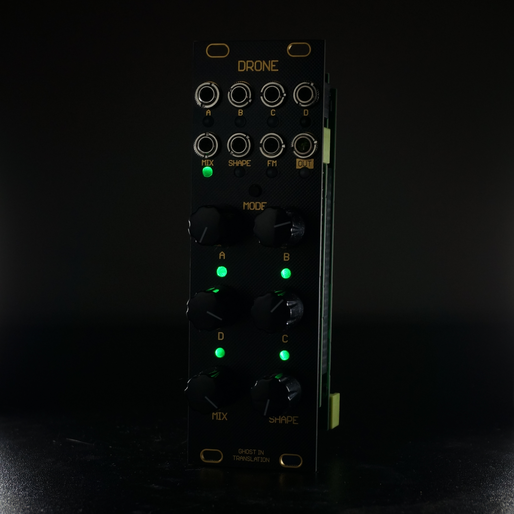

# Drone User Manual

Drone is a modular drone synthesizer based on my Motherboard platform. Current version is using a Pico 2 (RP2350).

Available on https://www.ghostintranslation.com/

This module is going to be fully open-source, but I have yet to document everything.

## Features

* 4 individual voices
* 16 algorithms
* 32 bit float DSP
* Stereo audio (48kHz, 32-bit)
* MIDI TRS Type A IN and OUT
* Auto calibration
* Either-way power

## Technical Specifications

* **Module Width**: 8 HP
* **Depth**: 50 mm
* **Power Consumption**:
  * **+12V**: 75 mA
  * **-12V**: 3.5 mA
* **CV Input Range**: 0V to 5V

## Controls and CV Inputs

The front panel features controls for adjusting the tuning, timbral shape, and volume mix of the 4 voices.

All CV inputs read voltages between 0 and 5V. 

### Knobs
* **A B C D**: Sets the base pitch/tuning for each of the four individual voices.
* **MIX**: Turning this knob morphs the volumes of the four voices in a spiral motion.
* **SHAPE**: Adjusts the main character of the sound (such as morphing wavetables, filter sweeps, or FM intensity).

### CV Inputs
* **CV A, B, C, D**: 1V/Octave pitch CV inputs for each voice.
* **CV MIX**: Modulates the Mix parameter.
* **CV SHAPE**: Modulates the Shape parameter.
* **CV FM**: Linear frequency modulation for all four voices. 

### Navigation Button
* **Mode button**:
  * **Short Press**: Enters Algorithm Selection Mode (when in normal play mode) or cycles to the next algorithm (when in selection mode).
  * **Long Press (1 second)**: Toggles Looper Mode (enters or exits).

## Menu

### Normal Play Mode
In normal play mode:
* The **8 LEDs at the top** display real-time levels of the control inputs and the main audio output.
* The **4 LEDs in the middle** show the volume of each of the four voices.

### Algorithm Selection Mode
To change the active sound algorithm:

1. **Enter Menu**: Short press the **Mode button**. All 8 top LEDs will turn solid **Blue**, except for the active selection.
2. **Read Active Selection**: The active selection is shown by two blinking **Green** LEDs:
   * **Bank Indicator** (one of the first 4 LEDs)
   * **Algorithm Indicator** (one of the last 4 LEDs)
3. **Change Algorithm**: Tap the **Mode button** to cycle to the next algorithm.
4. **Save & Exit**: After **5 seconds** of inactivity, the module saves your choice and returns to play mode automatically.

## The 16 Algorithms

The module contains 16 algorithms. Below is an overview of what each algorithm does and what the **SHAPE** knob controls.

### Bank 1
| # | Sound Description | What the **SHAPE** Control Does |
| :--- | :--- | :--- |
| 1 | **Sine-Resonant Noise**: A mix of warm, pure sine waves and soft resonant noise. | Blends from pure sine tones (0%) to wind-like resonant noise (100%). |
| 2 | **Resonant Noise**: Filters white noise into whistle-like pitched tones. | Sets Q-resonance. Turn up to morph from ocean-wave wind sounds to sharp, whistling pitches. |
| 3 | **Sine-Phaser-Ring**: Stereo phase-shifted sines combined with ring modulation. | Sets Ring Modulator speed (60Hz to 160Hz) to add metallic, sci-fi buzzes. |
| 4 | **Sine-FM**: Warm frequency modulation synthesis. | Sets modulator speed and modulation depth, introducing growling sidebands and metallic overtones. |

### Bank 2 
| # | Sound Description | What the **SHAPE** Control Does |
| :--- | :--- | :--- |
| 1 | **Saw-Comparator**: Gated, aggressive digital saw waves. | Sets the clipping threshold on the sum of the 4 saw waves. |
| 2 | **Slink Filter**: 8 parallel resonant bandpass filters swept by a complex LFO. | Adjusts sweep rate, ripple spacing, and filter density for vocal "formant" sweeps. |
| 3 | **FM & Wavefolder**: Aggressive, harmonically rich wavefolded FM voice. | Drives FM depth and folding intensity to add sharp digital bite and buzz. |
| 4 | **Karplus-Strong Plucks**: Simulated plucked and bowed string resonances. | Changes the brightness/filtering of the plucking excitation. Morphs from dark thuds to metallic plucks. |

### Bank 3
| # | Sound Description | What the **SHAPE** Control Does |
| :--- | :--- | :--- |
| 1 | **Gong & Bells**: Inharmonic 4-operator FM chain recreating metallic bells. | Acts as modulation index. Morphs from simple sine tones to complex clangs and gong washes. |
| 2 | **Dust-Triangle**: Warm triangle drone mixed with crackling rain impulses. | Blends between crackling, pitched rain clicks (0%) and a clean, warm triangle wave drone (100%). |
| 3 | **PWM (Pulse-Width Modulation)**: Thick, stereo-panned square waves with a custom foldback distortion waveshaper. | Morphs the pulse width (duty cycle) of the square waves to change the harmonic profile. |
| 4 | **Resonant Saw & Saturation**: Saturated sawtooth waves routed through a resonant lowpass filter. | Sweeps filter cutoff (200Hz to 6kHz), increases filter resonance, and drives the saturation level. |

### Bank 4
| # | Sound Description | What the **SHAPE** Control Does |
| :--- | :--- | :--- |
| 1 | **Wavetable 1: "Octopus"**: Complex 3D wavetable morphs with cascading modulation. | Scans smoothly through 128 waves to change the fundamental timbre. |
| 2 | **Wavetable 2: "Bells"**: Metallic bell-like wavetable morphs with cascading modulation. | Scans smoothly through 128 waves to change the fundamental timbre. |
| 3 | **Wavetable 3: "Fly By One"**: Vocal and sci-fi wavetable morphs with cascading modulation. | Scans smoothly through 128 waves to change the fundamental timbre. |
| 4 | **Wavetable 4: "Yin Yang"**: Deep, harmonically complex wavetable morphs. | Scans smoothly through 128 waves to change the fundamental timbre. |

## Looper

Drone features a built-in Looper to record and loop knob movements (TUNE A-D, MIX, SHAPE) up to **1 minute**, or **32 bars** when synchronized to a MIDI clock.

* **Enter / Exit Looper**: Hold the **Mode button** for **1 second**.
* **Start Recording**: Short press the **Mode button** while in **Idle** (all 8 LEDs solid **Red**).
* **Stop & Loop**: Short press the **Mode button** while recording (LEDs fill from **Red to Blue**). If MIDI clock is present, the loop stop is quantized to the next beat.
* **Reset / Clear**: Short press the **Mode button** during Playback to erase the loop and return to Idle.
* **Overdub**: Move any knob during Playback to record new values.
* **MIDI Sync**: recording and Playback automatically sync to external MIDI clock. A MIDI Start message resets Playback to the start of the loop.

## MIDI

Drone listens to and transmits on **Channel 1**.

### Control Change (CC) Mapping
* **CC 1**: Voice A Tune
* **CC 2**: Voice B Tune
* **CC 3**: Voice C Tune
* **CC 4**: Voice D Tune
* **CC 5**: Mix
* **CC 6**: Shape

### Clock & Transport
* **MIDI Clock**: Synchronizes Looper recording and playback speed.
* **MIDI Start**: Resets loop playback to the beginning.

## Firmware Update

The firmware update process is as follows:

1. **Power Off the Module**: Disconnect the module from power.
2. **Press and hold BOOTSEL**: Locate the physical **BOOTSEL** button on the microcontroller (Pico 2) on the back of the module, and hold it down.
3. **Connect to Computer**: While holding the **BOOTSEL** button, connect the Pico 2 to your computer via a USB cable.
4. **Release BOOTSEL**: Once the USB cable is plugged in, release the button. The Pico 2 will mount on your computer as a USB mass storage drive.
5. **Transfer the Firmware**: Locate the compiled firmware file [firmware/drone.ino.uf2](firmware/drone.ino.uf2). Drag and drop (or copy) the `.uf2` file onto the drive.
6. **Automatic Reboot**: The Pico 2 will write the new firmware to its flash memory, automatically eject/unmount, and reboot with the updated firmware running.

## Troubleshooting

### No Sound Output
* Verify that the eurorack power ribbon cable is connected correctly.
* Sweep the **Mix** and **Shape** knobs to see if that makes any difference. 
* Make sure your audio cable is patched securely.
* Switch off and switch on the module to restart the microcontroller.