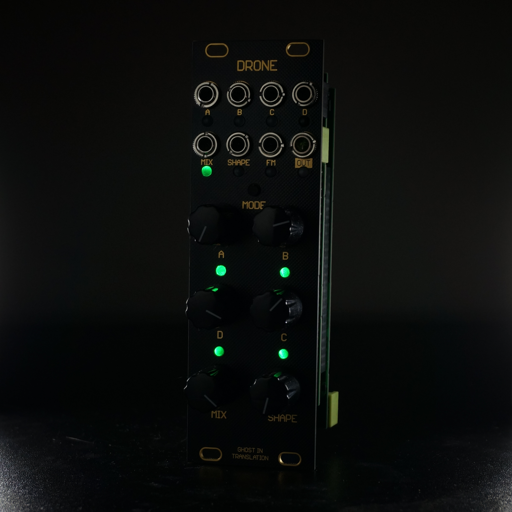

# Drone

Drone is a modular drone synthesizer based on my Motherboard platform. Current version uses a Pico 2 (RP2350).

Available on https://www.ghostintranslation.com/

This module is going to be fully open-source, but I have yet to document everything.

## User Manual

The complete user manual, including controls, algorithm guide, looper operation, and firmware update instructions, is available in PDF format:

👉 **[Download Drone User Manual (PDF)](./docs/user-manual.pdf)**